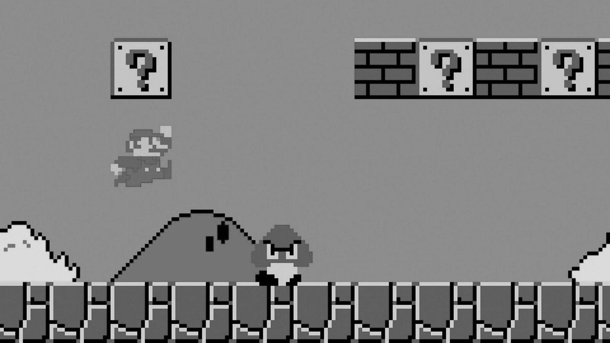
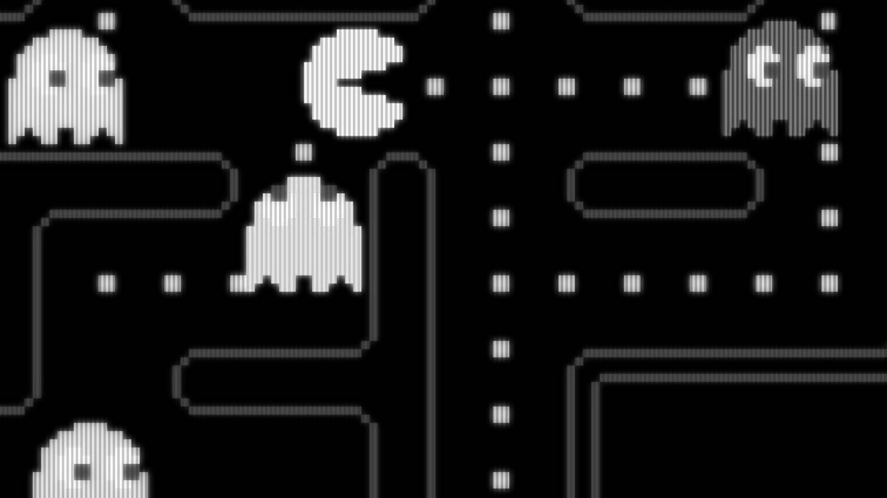

title: "GGJ20"
controls: false
progress: true
theme: ./theme

--

# GGJ 2020

## Reaktor HQ, Amsterdam

--

# Global Game Jam

- Game development hackathon (**48 hours**)
- Worldwide: **30,000** people in
  [100+ countries](https://globalgamejam.org/status)
- No prizes / competition
- Meeting other game developers

--

# The basic rules

- Global (**secret**) theme, revealed at **17.00** (local time)
- Optional [diversifiers](https://globalgamejam.org/2020/diversifiers)
- Creative Commons (BY-NC-SA) license

-- dark

# Reaktor

## Location Sponsor

-- dark

### Building facilities

- Toilets upstairs/downstairs
- Coffee / fridges
- Closing around **24.00** (open at **9.00**)

--

# Friday

- Introductions
- Keynote & **theme reveal**
- Brain storming & **forming groups**
- Start jamming!
- Close at 24.00

--

# Saturday

- Open at 9.00
- **Work on your game**
- Playtesting
- Close at 24.00

--

# Sunday

- Open at 9.00
- Work on your game
- **Upload games** from 15.00 - 17.00
- Team demos/presentations

-- dark

# Keynote

## Theme Reveal

--

### Jamming Tips

- Innovate in 1 area (tech, platform, mechanics...)
- Use **diversifiers** as inspiration
- **Talking** about ideas: max 1 hour
- Prototyping with **paper** or whiteboard
- Don't get stuck implementing a single feature
- **Playtest** with other teams

-- dark

# Happy Jamming!

- **Create profile** on [globalgamejam.org](https://globalgamejam.org)
- Review the GGJ
  **[code of conduct](https://globalgamejam.org/inclusiveness-policy-and-code-conduct)**
- **Keep theme secret** until Hawaii starts! (4.00)

